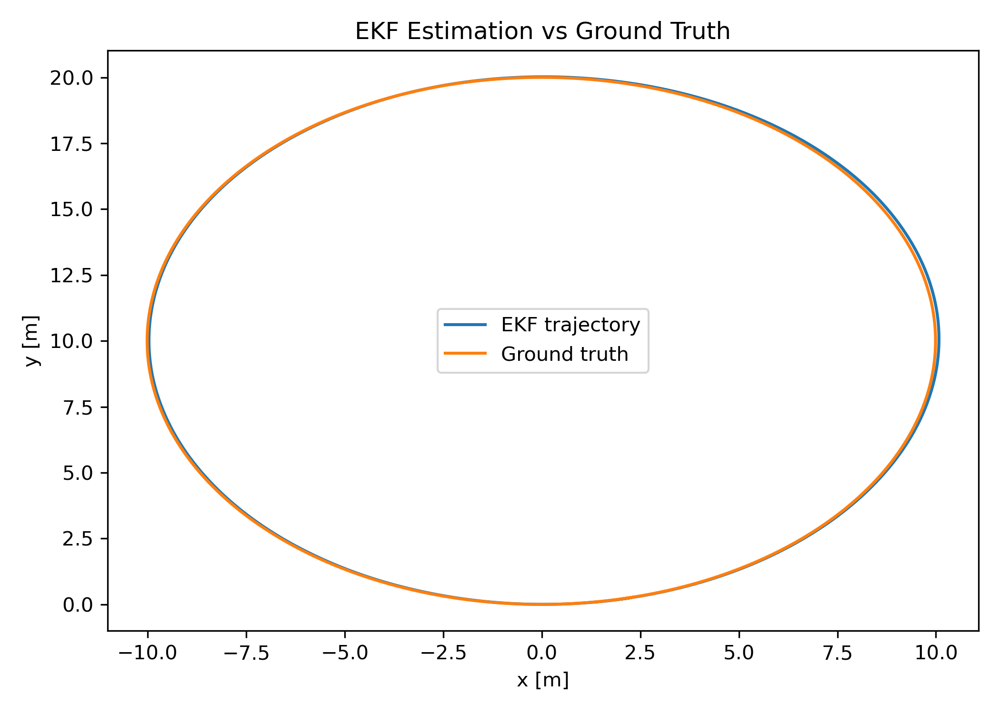

# Car-Like Robot EKF ROS2 Package

This repository provides a **C++ Extended Kalman Filter (EKF)** for a car-like robot in **ROS 2 (Kilted)**, a **Python simulator**, a **trajectory tracker (PID/Pure‑Pursuit)**, and tools for **recording & evaluating** runs (metrics + RViz animations).

---

## Repository Structure

```
src/kalman_filter/
├── CMakeLists.txt
├── package.xml
├── include/
│   ├── KalmanFilter.hpp
│   └── EKF.hpp
├── src/
│   ├── EKF.cpp
│   ├── EKF_ros_node.cpp
│   ├── kalman_filter_ros_node.cpp
│   ├── KalmanFilter.cpp
│   ├── PID_controller.cpp
│   └── reference_path_publisher.cpp
├── scripts/
│   └── car_like_sim.py
├── kf_pose.csv
├── true_pose.csv
├── runs
│   ├── EKF_vs_GT_trajectory_Carlike_robot.png
│   ├── EKF_vs_GT_animation.gif
│   ├── kf_pose.csv
│   ├── true_pose.csv
│   ├── plot_traj.py
│   ├── metrics_logger.py
│   ├── Rviz_output_pursue_pid.mp4
│   └── Rviz_output_pursue_pid.gif
└── README.md
```

---

### Estimation (EKF)
- **State**: \([x,\ y,\ \theta,\ v]\)  
- **Inputs**: \([a,\ \omega]\) from IMU  
- **Measurement**: \(v\) from wheel encoder  
- **Output**: `/kf/pose` (`geometry_msgs/PoseStamped`)

### Trajectory Tracking (Controller)
- **Reference path**: `/path` (`nav_msgs/Path`) from the ellipse publisher  
- **Control**:  
  - **Longitudinal** = acceleration command \(a\) via PI (node publishes `cmd.linear.x`)  
  - **Lateral** = steering rate \(\omega\) via Pure‑Pursuit / LQR‑ready structure (`cmd.angular.z`)  
- **Command topic**: `/cmd_vel` (`geometry_msgs/Twist`)  
  - `linear.x` = **acceleration** \(a\) (m/s²)  
  - `angular.z` = **yaw rate** \(\omega\) (rad/s)

> The simulator expects **acceleration** on `cmd.linear.x` (not linear velocity).

---
## Requirements

- Ubuntu 24.04 / WSL2  
- ROS 2 Kilted  
- C++17 compiler  
- Python 3 (system), with:
  - `rclpy`
  - `sensor_msgs`
  - `std_msgs`
  - `geometry_msgs`
- Python dependencies for analysis:
  - `pandas`
  - `numpy`
  - `matplotlib`

---

### 1) Start the simulator
```bash
ros2 run kalman_filter car_like_sim.py
```
Publishes:
- `/imu/data` (`sensor_msgs/Imu`)
- `/encoder/speed` (`std_msgs/Float64`)
- `/sim/true_pose` (`geometry_msgs/PoseStamped`)

### 2) Start the EKF
```bash
ros2 run kalman_filter EKF_ros_node
```
Publishes:
- `/kf/pose` (`geometry_msgs/PoseStamped`)

### 3) Publish a reference path
```bash
ros2 run kalman_filter reference_path_publisher
```
Publishes:
- `/path` (`nav_msgs/Path`) — ellipse by default

### 4) Start the controller (PID / Pure‑Pursuit)
```bash
ros2 run kalman_filter PID_controller \
  --ros-args -p pose_topic:=/kf/pose -p v_ref:=1.0 -p lookahead_distance:=1.0
```
**Key parameters**
- `v_ref` — target cruise speed (m/s) used by the longitudinal PI  
- `lookahead_distance` — tracking aggressiveness (m); try 0.8–1.5  
- `a_max`, `omega_max` — actuator saturation (match the simulator)

---

## RViz Visualization

**Quick setup**
1. Open `rviz2`
2. Set **Fixed Frame**: `map`
3. **Add → Path**: select `/path` (reference, colored line)
4. **Add → Pose**: select `/kf/pose` (estimator path; increase **History Length** for trail)
5. *(Optional)* **Add → Pose**: `/sim/true_pose` (ground truth)

**Example output (Pure‑Pursuit PID)**  


---
## Data Logging

Record both EKF and ground truth for offline analysis:

```bash
ros2 topic echo /kf/pose --csv > kf_pose.csv
ros2 topic echo /sim/true_pose --csv > true_pose.csv
```

---

## Plots & Animation

### Static Trajectory Plot

```bash
python3 scripts/animate_kf.py
# Generates:
#  - EKF_vs_GT_trajectory_Carlike_robot.png
#  - EKF_vs_GT_animation_fast_dashed.gif
```



### Animated Comparison


---

## Tuning Tips

- **Process noise Q**: Increase `Q(2,2)` (heading) to allow more flexibility in gyro integration.  
- **Measurement noise R**: Adjust based on encoder accuracy.  
- **Sampling rate**: 50 Hz is realistic for car-like robots.

---

## Contributing

Pull Requests and Issues are welcome!  
Please include:
- Clear description of changes
- Updated plots or metrics if behavior changes

---

## License

This project is licensed under the **MIT License**.  
