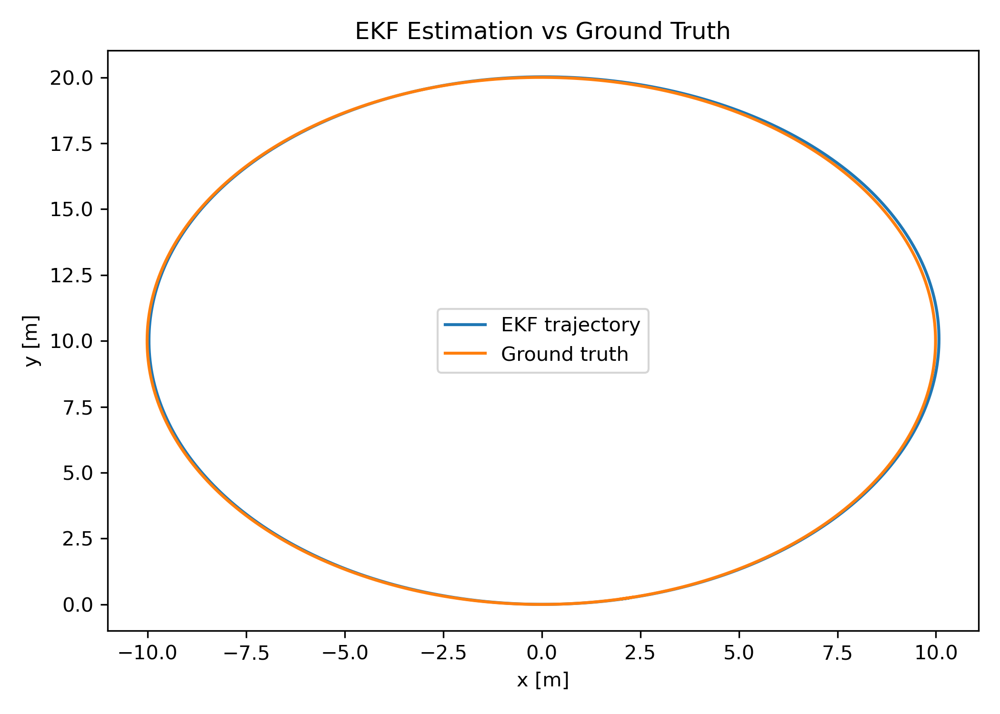

# Car-Like Robot EKF ROS2 Package

This repository provides a **C++ Extended Kalman Filter (EKF)** implementation for a car-like robot in **ROS 2 (Kilted)**, along with a **Python simulator**, data logging, and post‑processing scripts for trajectory visualization and animation.

---

## Repository Structure

```
kalman_filter/
├── CMakeLists.txt
├── package.xml
├── include/
│   ├── KalmanFilter.hpp
│   └── EKF.hpp
├── src/
│   ├── KalmanFilter.cpp
│   ├── kalman_filter_ros_node.cpp
│   ├── EKF.cpp
│   └── EKF_ros_node.cpp
├── scripts/
│   └── car_like_sim.py
├── runs/
│   ├── kf_pose.csv
│   ├── true_pose.csv
│   ├── plot_traj.py
│   ├── EKF_vs_GT_trajectory_Carlike_robot.png
│   └── EKF_vs_GT_animation_fast_dashed.gif
└── README.md
```

---

## Overview

This package demonstrates an EKF for 2D pose estimation of a car-like robot:

- **State vector**:  
  \[ x, y, θ, v \]  
  – position, heading, velocity
- **Inputs**:  
  \[ a, ω \]  
  – longitudinal acceleration (IMU), yaw rate (IMU)
- **Measurements**:  
  \[ v \]  
  – velocity from wheel encoder

A Python script simulates the robot motion and publishes IMU and encoder data, as well as ground truth pose. The EKF node fuses these to estimate the robot’s trajectory.

---

## Requirements

- Ubuntu 24.04 / WSL2  
- ROS 2 Kilted  
- C++17 compiler  
- Python 3 (system), with:
  - `rclpy`
  - `sensor_msgs`
  - `std_msgs`
  - `geometry_msgs`
- Python dependencies for analysis:
  - `pandas`
  - `numpy`
  - `matplotlib`

---

## Installation & Build

```bash
# Clone and build in your ROS 2 workspace
cd ~/ros2_ws/src
git clone https://github.com/AayushmanSharma96/ROS2-Kalman-Filter.git
cd ~/ros2_ws
colcon build --packages-select kalman_filter
source install/setup.bash
```

---

## Running the Simulation & EKF

### 1. Launch the Python Simulator

```bash
ros2 run kalman_filter car_like_sim.py
```

This node publishes:
- `/imu/data`        → `sensor_msgs/msg/Imu`
- `/encoder/speed`   → `std_msgs/msg/Float64`
- `/sim/true_pose`   → `geometry_msgs/msg/PoseStamped`

### 2. Launch the EKF Node

In a new terminal (after sourcing):

```bash
ros2 run kalman_filter EKF_ros_node
```

This node subscribes to IMU and encoder, runs the EKF, and publishes:
- `/kf/pose`        → `geometry_msgs/msg/PoseStamped`

---

## Data Logging

Record both EKF and ground truth for offline analysis:

```bash
ros2 topic echo /kf/pose --csv > kf_pose.csv
ros2 topic echo /sim/true_pose --csv > true_pose.csv
```

---

## Plots & Animation

### Static Trajectory Plot

```bash
python3 runs/plot_traj.py
# Generates:
#  - EKF_vs_GT_trajectory_Carlike_robot.png
#  - EKF_vs_GT_animation_fast_dashed.gif
```



### Animated Comparison


---

## Tuning Tips

- **Process noise Q**: Increase `Q(2,2)` (heading) to allow more flexibility in gyro integration.  
- **Measurement noise R**: Adjust based on encoder accuracy.  
- **Sampling rate**: Currently set to 50 Hz. If required, change dt in both simulator and node.

---


